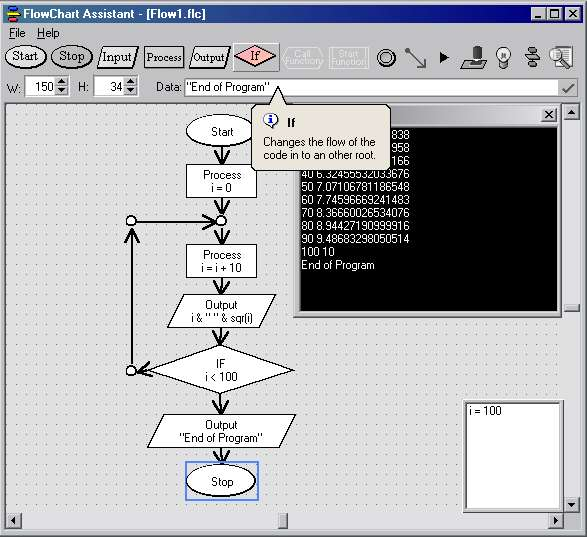



## FlowChart \*Update\*

### Description

Create and Test your flowcharts

Add variable watches and execute command-to-command

Export VB and Pascal Code

Syntax Simmilar to VBScript
 
### More Info
 

             |
---                |---
**Submitted On**   |2004-03-21 19:56:46
**By**             |[Lefteris Eleftheriades](https://github.com/Planet-Source-Code/PSCIndex/blob/master/ByAuthor/lefteris-eleftheriades.md)
**Level**          |Advanced
**User Rating**    |4.9 (113 globes from 23 users)
**Compatibility**  |VB 5\.0, VB 6\.0
**Category**       |[Complete Applications](https://github.com/Planet-Source-Code/PSCIndex/blob/master/ByCategory/complete-applications__1-27.md)
**World**          |[Visual Basic](https://github.com/Planet-Source-Code/PSCIndex/blob/master/ByWorld/visual-basic.md)
**Archive File**   |[FlowChart1722823212004\.zip](https://github.com/Planet-Source-Code/lefteris-eleftheriades-flowchart-update__1-52489/archive/master.zip)

### Source Code

you'll love it, please vote

